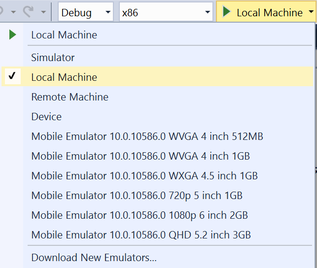
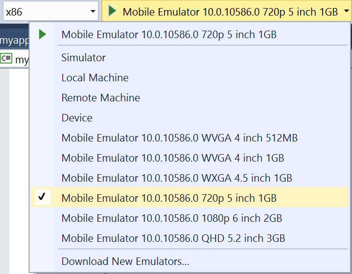
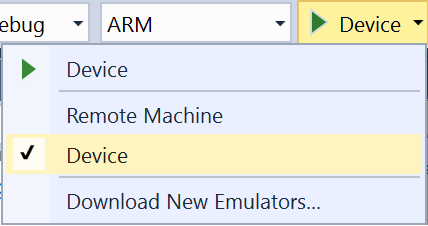
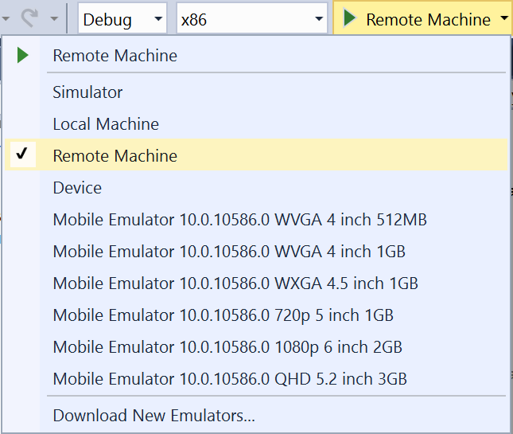
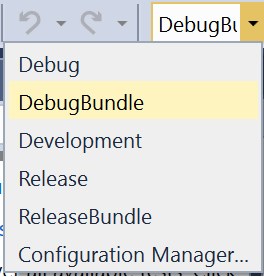

## Running the Universal Windows App

Running a React Native Universal Windows app is easy. Open your solution in Visual Studio 2015, follow the instructions below for the device family you want to deploy to, and press F5. Visual Studio will pull in the NuGet dependencies, build, deploy, and launch the application.

We're also planning on creating a `run-windows` command. In the meantime, just use Visual Studio. 

### Desktop

Set the Platform build target to something compatible with your host OS, and choose the Local Machine deployment target.



### Mobile Emulator

Set the Platform build target to something compatible with your host OS, and choose the Mobile Emulator you wish to deploy to.

You may have to install the Windows 10 Mobile emulators for Visual Studio. Instructions are [here](https://msdn.microsoft.com/en-us/windows/uwp/debug-test-perf/test-with-the-emulator). You may also have to enable Hyper-V on your machine, instructions are [here](https://msdn.microsoft.com/library/windows/apps/xaml/jj863509.aspx).



### Device

Set the Platform build target to something compatible with your device OS (typically ARM), and choose the Device deployment target.



### Xbox

Assuming you have already [enabled Developer Mode on your Xbox](https://msdn.microsoft.com/en-us/windows/uwp/xbox-apps/devkit-activation), deploying to Xbox is easy, just follow the instructions to set up your development environment for Remote Machine deployment [here](https://msdn.microsoft.com/en-us/windows/uwp/xbox-apps/development-environment-setup).



## Accessing development server from device

If you are running the Universal Windows app on a device or Xbox, you'll need to configure the IP address of the `DevSupportManager` to match your machine's IP address.

We're working on creating a settings page to manage the debug server host address, but for now you can statically configure it in [`DevInternalSettings`](https://github.com/ReactWindows/react-native-windows/blob/master/ReactWindows/ReactNative/DevSupport/DevInternalSettings.cs#L52)

## Using offline bundle

If you generated your project using `rnpm-plugin-windows`, the solution is already set up with two Configurations for running from an offline bundle, `DebugBundle` and `ReleaseBundle`.



Before deploying with this configuration, you'll have to generate the `index.windows.bundle` file with the following command:

```
react-native bundle --platform windows --entry-file index.windows.js 
    --bundle-output windows\myapp\ReactAssets\index.windows.bundle
    --assets-dest windows\myapp\ReactAssets
```

To generate the release (minified) bundle, add the --dev=false : 

```
react-native bundle --platform windows --entry-file index.windows.js 
    --bundle-output windows\myapp\ReactAssets\index.windows.bundle
    --assets-dest windows\myapp\ReactAssets
    --dev false
```

Be sure to update the paths to match the path to your ReactAssets folder.
